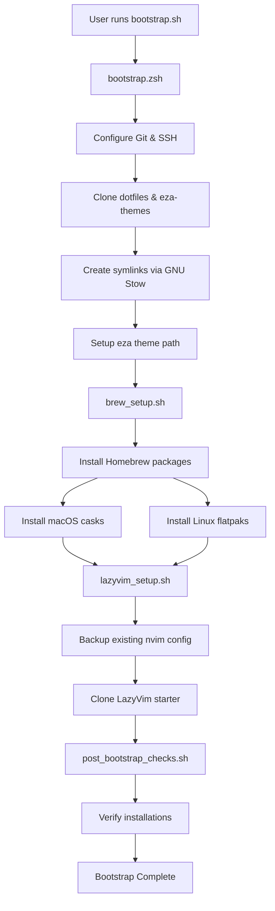

################################################################################

# Dotfiles

################################################################################

This repository provides a reproducible setup for **macOS**, **Linux**, and
**Bazzite** environments using:

- **Homebrew + Brewfile** for CLI tools, macOS casks, and Flatpaks
- **Bootstrap scripts** for Git/SSH setup, dotfiles cloning, and symlink management
- **LazyVim** for a modern Neovim experience (optional)

---

################################################################################

# What You Get

################################################################################

✔ Automated Git + SSH key setup (ed25519, GitHub-ready)  
✔ Dotfiles cloned and symlinked via GNU Stow  
✔ Unified eza theme configuration across macOS and Linux  
✔ Homebrew taps, CLI tools, macOS casks, and Flatpaks installed declaratively  
✔ Optional LazyVim installation for Neovim  
✔ Post-bootstrap sanity checks for critical tools  

---

################################################################################

# Quick Start

################################################################################

Clone the repo and run the orchestrator script:

```bash
git clone git@github.com:bourbonfgiles/dotfiles.git ~/repos/personal/dotfiles
zsh ~/repos/personal/dotfiles/.config/scripts/bootstrap.zsh
```

This will:

- Configure Git & SSH keys
- Clone dotfiles and eza-themes
- Create symlinks via GNU Stow
- Normalize eza theme path across macOS/Linux
- Install all tools via `brew bundle` (including Flatpaks on Linux)
- Optionally install LazyVim for Neovim
- Run post-bootstrap checks

---

################################################################################

# Bootstrap Flow

################################################################################



################################################################################

# Repository Structure

################################################################################

```
    .config/
      hammerspoon - macOS customisations
      k9s         - Kubernetes TUI
      nvim        - LazyVim starter + customisations
      scripts/    - Bootstrap and setup scripts
      starship    - Starship prompt config
    .zshrc        - ZSH configuration
    brewfile      - Homebrew taps, formulae, casks, and Flatpaks
    bootstrap.zsh - Core bootstrap (Git, SSH, clone, stow)
```

---

################################################################################

# Brewfile Overview

################################################################################

Your brewfile installs:

- **Taps**: Azure, Cloudflare, custom taps for DevOps tooling
- **CLI Tools**:
  `argocd`, `azure-cli`, `kubectl`, `helm`, `helmfile`, `lazygit`,
  `eza`, `fd`, `fzf`, `starship`, `ripgrep`, `bat`, `bottom`, `direnv`, 
  `carapace`, `go`, `node`, `python`, `rust`, `shellcheck`, `terraform-docs`, 
  `pre-commit`, `podman`, `postgresql`, `zoxide`, etc.
- **macOS Casks**:
  Alfred, Ghostty, Hammerspoon, Slack, fonts, Postman, Warp, Zoom
- **Flatpaks** (Linux):
  Discord, Firefox, Signal, Spotify, LibreOffice, OpenRGB
  *(Gaming apps like Steam/Lutris skipped on Bazzite)*

Run manually if needed:

```bash
cd ~/repos/personal/dotfiles
brew bundle
```

---

################################################################################

# LazyVim Setup (Optional)

################################################################################

If you skip the script, install manually:

```bash
mv ~/.config/nvim{,.bak}
git clone https://github.com/LazyVim/starter ~/.config/nvim
rm -rf ~/.config/nvim/.git
nvim
```

Inside Neovim:

```
:LazyHealth
```

---

################################################################################

# Why This Approach?

################################################################################

- **Homebrew** is cross-platform and works seamlessly on macOS and Linux (including Bazzite)
- **brew bundle** supports taps, formulae, casks, and Flatpaks in one declarative file
- **Scripts call scripts** for modularity and reproducibility
- **LazyVim** provides a modern Neovim experience with minimal manual setup
- **GNU Stow** ensures safe, reversible symlink management for dotfiles
