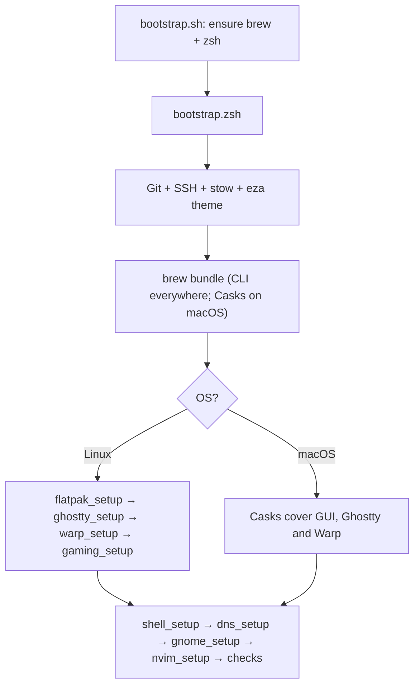

# Dotfiles

Reproducible setup for three targets that share one bootstrap and the same tooling:

- **macOS**
- **Bazzite** (atomic Fedora, gaming built in)
- **Fedora Silverblue** (atomic Fedora)

## Model

- **CLI tools → Homebrew** (`brewfile`), identical on every target.
- **GUI apps → Homebrew Casks on macOS, native Flatpak on Linux** (`flatpaks`).
- **Ghostty** → Homebrew cask on macOS; `scottames/ghostty` COPR layered with `rpm-ostree` on atomic Fedora (not on Flathub, no official Linux brew formula).
- **Warp** → Homebrew cask on macOS; official Warp RPM repo layered with `rpm-ostree` on atomic Fedora (not on Flathub).
- **Gaming** → native on Bazzite; installed as Flatpaks (`flatpaks-gaming`) on Silverblue, which also prints an optional "rebase to `bazzite-gnome`" note.
- **GNOME desktop** → Dash to Dock + Tiling Shell on Linux, reproduced from `dconf/`; Hammerspoon on macOS.

Flatpaks are installed by a dedicated script (not `brew bundle`), which is the documented Bazzite approach and needs no root.

## Quick start

One entry point on every OS. `bootstrap.sh` (bash) guarantees Homebrew + zsh, then hands off to `bootstrap.zsh`, which runs everything else in order — so you only kick off a single script:

```bash
git clone git@github.com:bourbonfgiles/dotfiles.git ~/repos/personal/dotfiles
bash ~/repos/personal/dotfiles/bootstrap.sh
```

It installs Homebrew and zsh if missing, configures Git/SSH, stows the dotfiles, runs `brew bundle`, then on Linux installs the Flatpaks, Ghostty and Warp (`rpm-ostree`) and gaming apps (Silverblue), sets zsh as the default shell, configures DNS-over-TLS, applies the GNOME desktop tweaks, and syncs the stowed Neovim config. Once zsh is your login shell you can also re-run `zsh ~/repos/personal/dotfiles/bootstrap.zsh` directly.

## What each target gets

| Area | macOS | Bazzite | Silverblue |
| --- | --- | --- | --- |
| CLI tools | Homebrew | Homebrew | Homebrew |
| GUI apps | Casks | Flatpak | Flatpak |
| Ghostty | Cask | COPR (`rpm-ostree`) | COPR (`rpm-ostree`) |
| Warp | Cask | RPM repo (`rpm-ostree`) | RPM repo (`rpm-ostree`) |
| Gaming | — | native (in image) | Flatpaks (+ optional rebase) |
| Desktop tweaks | Hammerspoon | Dash to Dock + Tiling Shell | Dash to Dock + Tiling Shell |

## App parity

- **Both** (Cask on macOS / Flatpak on Linux): OnlyOffice, Zen, Spotify, Discord, Slack, Zoom, Zed, Postman, Insomnia, pgAdmin4, Podman Desktop, Neovide.
- **Terminals** (Cask on macOS / official repo via `rpm-ostree` on Linux — neither is on Flathub): Ghostty, Warp.
- **Linux only**: Signal, ZapZap (WhatsApp), Steam, OpenRGB, Evolution.
- **macOS**: excludes Signal, WhatsApp, and Steam (work rules); Microsoft Office in place of OnlyOffice.

## Bootstrap flow


```mermaid
flowchart TD
  S[bootstrap.sh: ensure brew + zsh] --> A[bootstrap.zsh]
  A --> B[Git + SSH + stow + eza theme]
  B --> C["brew bundle (CLI everywhere; Casks on macOS)"]
  C --> D{OS?}
  D -->|Linux| E[flatpak_setup → ghostty_setup → warp_setup → gaming_setup]
  D -->|macOS| H[Casks cover GUI, Ghostty and Warp]
  E --> Z[shell_setup → dns_setup → gnome_setup → nvim_setup → checks]
  H --> Z
```

## Repository structure

```
brewfile          Homebrew packages, organized per OS (shared CLI / macOS / Linux)
flatpaks          Flathub app IDs for Linux GUI apps
flatpaks-gaming   Flathub gaming app IDs (Silverblue; native on Bazzite)
bootstrap.sh      Entry point (bash): ensures Homebrew + zsh, then runs bootstrap.zsh
bootstrap.zsh     Orchestrator: Git/SSH/clone/stow/eza, then runs all setup scripts in order
dconf/            Tracked GNOME dconf (tilingshell.conf, dash-to-dock.conf)
.config/
  scripts/
    bootstrap.zsh          Shim → repo-root bootstrap.zsh (back-compat)
    brew_setup.zsh         brew bundle
    flatpak_setup.zsh      Installs flatpaks (Linux)
    ghostty_setup.zsh      Installs Ghostty per OS
    warp_setup.zsh         Installs Warp via official RPM repo (Linux) / cask (macOS)
    gaming_setup.zsh       Gaming Flatpaks + rebase note (Silverblue)
    shell_setup.zsh        Sets zsh as the default login shell (Linux)
    dns_setup.zsh          DNS-over-TLS (systemd-resolved on Linux)
    gnome_setup.zsh        Dash to Dock + Tiling Shell + dconf (GNOME)
    nvim_setup.zsh         Syncs the stowed LazyVim config (never clobbers it)
    post_bootstrap_checks.zsh  Quick post-install checks
    health_check.zsh       Full post-install verification
    lib_os.zsh             Shared OS detection
  ghostty/ k9s/ nushell/ nvim/ starship/   App configs (stowed)
.zshrc            ZSH configuration
.spacemacs        Spacemacs configuration
```

## Notes for immutable distros (Bazzite / Silverblue)

- **Stow** only writes symlinks into `$HOME` (writable on atomic systems), so it works normally — just install `stow` via Homebrew, not `rpm-ostree`.
- **Neovim/LazyVim** config is stowed from this repo (`.config/nvim`); `nvim_setup.zsh` only syncs plugins via **Lazy**/**Mason** and never overwrites it. The brew language servers exist for CLI use and the occasional Spacemacs/Doom session.
- **Ghostty and Warp** are layered with `rpm-ostree` (neither is on Flathub), so a reboot is required after first install or after migrating Warp off a local RPM.
- **GNOME** (Bazzite/Silverblue): `gnome_setup.zsh` installs Dash to Dock and Tiling Shell and applies the tracked `dconf/` settings; log out/in to load newly installed extensions.
- **Flatpaks** install at `--user` scope; apps already present (e.g. Bazzite's pre-installed set) are detected and skipped.

## Editors

Neovim (LazyVim) is the primary editor and default `$EDITOR`; its config is stowed from `.config/nvim` and synced (never overwritten) by `nvim_setup.zsh`. Spacemacs is cloned during bootstrap and remains available; language servers are on `$PATH` for it (and for Doom, if used).
## Shell & cross-platform
`zsh` is the login shell on every target — native on macOS, set via `usermod` on Bazzite/Silverblue (which ship no `chsh`). `.zshrc` loads Homebrew's `shellenv` directly (Apple Silicon `/opt/homebrew`, Intel `/usr/local`, Linux `/home/linuxbrew`) so the same brewed CLI tools are on `PATH` in both login and non-login shells (Warp/Ghostty start non-login). Prompt/completion init is `command -v`-guarded, so the config itself is OS-agnostic. The platform-specific pieces live in the setup scripts, not `.zshrc`: GUI apps (casks vs Flatpak), Ghostty/Warp (casks vs rpm-ostree), Nerd Fonts (casks vs `fonts_setup.zsh`), and Albert's launcher hotkey (a GNOME custom shortcut, since Wayland blocks app-level global hotkeys).
