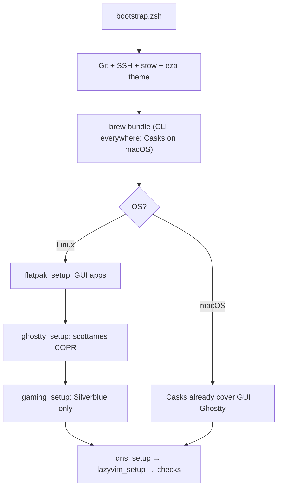

# Dotfiles

Reproducible setup for three targets that share one bootstrap and the same tooling:

- **macOS**
- **Bazzite** (atomic Fedora, gaming built in)
- **Fedora Silverblue** (atomic Fedora)

## Model

- **CLI tools → Homebrew** (`brewfile`), identical on every target.
- **GUI apps → Homebrew Casks on macOS, native Flatpak on Linux** (`flatpaks`).
- **Ghostty** → Homebrew cask on macOS; `scottames/ghostty` COPR layered with `rpm-ostree` on atomic Fedora (it is not on Flathub and has no official Linux brew formula).
- **Gaming** → native on Bazzite; installed as Flatpaks (`flatpaks-gaming`) on Silverblue, which also prints an optional "rebase to `bazzite-gnome`" note.

Flatpaks are installed by a dedicated script (not `brew bundle`), which is the documented Bazzite approach and needs no root.

## Quick start

macOS ships `zsh`. On Bazzite/Silverblue it is not preinstalled, so install it first (Homebrew is already present on Bazzite):

```bash
# Linux only: zsh is not preinstalled
brew install zsh

git clone git@github.com:bourbonfgiles/dotfiles.git ~/repos/personal/dotfiles
zsh ~/repos/personal/dotfiles/.config/scripts/bootstrap.zsh
```

The bootstrap installs Homebrew if missing, configures Git/SSH, stows dotfiles, runs `brew bundle`, then on Linux installs the Flatpaks, Ghostty, and (Silverblue) gaming apps, configures DNS-over-TLS, and installs LazyVim.

## What each target gets

| Area | macOS | Bazzite | Silverblue |
| --- | --- | --- | --- |
| CLI tools | Homebrew | Homebrew | Homebrew |
| GUI apps | Casks | Flatpak | Flatpak |
| Ghostty | Cask | COPR (`rpm-ostree`) | COPR (`rpm-ostree`) |
| Gaming | — | native (in image) | Flatpaks (+ optional rebase) |

## App parity

- **Both** (Cask on macOS / Flatpak on Linux): Ghostty, OnlyOffice, Zen, Spotify, Discord, Slack, Zoom, Zed, Warp, Postman, Insomnia, pgAdmin4, Podman Desktop, Neovide, Firefox.
- **Linux only**: Signal, ZapZap (WhatsApp), Steam, OpenRGB, Evolution.
- **macOS**: excludes Signal, WhatsApp, and Steam (work rules); keeps Microsoft Office alongside OnlyOffice.

## Bootstrap flow


```mermaid
flowchart TD
  A[bootstrap.zsh] --> B[Git + SSH + stow + eza theme]
  B --> C["brew bundle (CLI everywhere; Casks on macOS)"]
  C --> D{OS?}
  D -->|Linux| E[flatpak_setup: GUI apps]
  E --> F[ghostty_setup: scottames COPR]
  F --> G[gaming_setup: Silverblue only]
  D -->|macOS| H[Casks already cover GUI + Ghostty]
  G --> I[dns_setup → lazyvim_setup → checks]
  H --> I
```

## Repository structure

```
brewfile          Homebrew packages, organized per OS (shared CLI / macOS / Linux)
flatpaks          Flathub app IDs for Linux GUI apps
flatpaks-gaming   Flathub gaming app IDs (Silverblue; native on Bazzite)
bootstrap.zsh     Core bootstrap (Homebrew, Git, SSH, clone, stow)
.config/
  scripts/
    bootstrap.zsh          Orchestrator (runs everything in order)
    brew_setup.zsh         brew bundle
    flatpak_setup.zsh      Installs flatpaks (Linux)
    ghostty_setup.zsh      Installs Ghostty per OS
    gaming_setup.zsh       Gaming Flatpaks + rebase note (Silverblue)
    dns_setup.zsh          DNS-over-TLS (systemd-resolved on Linux)
    lazyvim_setup.zsh      LazyVim starter
    health_check.zsh       Post-install verification
    lib_os.zsh             Shared OS detection
  ghostty/ k9s/ nushell/ nvim/ starship/   App configs (stowed)
.zshrc            ZSH configuration
.spacemacs        Spacemacs configuration
```

## Notes for immutable distros (Bazzite / Silverblue)

- **Stow** only writes symlinks into `$HOME` (writable on atomic systems), so it works normally — just install `stow` via Homebrew, not `rpm-ostree`.
- **Neovim/LazyVim** installs its own language servers and linters via **Mason** (into `~/.local/share/nvim`). The brew language servers exist for CLI use and the occasional Spacemacs/Doom session.
- **Ghostty** is layered with `rpm-ostree`, so a reboot is required after first install.
- **Flatpaks** install at `--user` scope; apps already present (e.g. Bazzite's pre-installed set) are detected and skipped.

## Editors

Neovim (LazyVim) is the primary editor and default `$EDITOR`. Spacemacs is cloned during bootstrap and remains available; language servers are on `$PATH` for it (and for Doom, if used).
