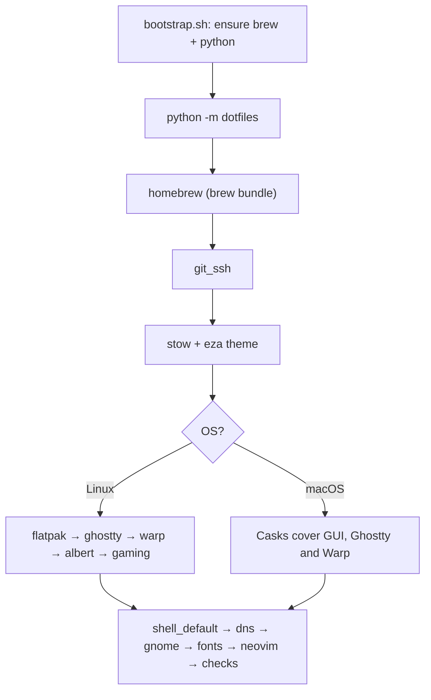

# Dotfiles

Reproducible setup for three targets that share one bootstrap and the same tooling:

- **macOS**
- **Bazzite** (atomic Fedora, gaming built in)
- **Fedora Silverblue** (atomic Fedora)

## Model

- **CLI tools → Homebrew** (`brewfile`), identical on every target.
- **GUI apps → Homebrew Casks on macOS, native Flatpak on Linux** (`flatpaks`).
- **Ghostty** → Homebrew cask on macOS; `scottames/ghostty` COPR layered with `rpm-ostree` on atomic Fedora (not on Flathub, no official Linux brew formula).
- **Warp** → Homebrew cask on macOS; official Warp RPM repo layered with `rpm-ostree` on atomic Fedora (not on Flathub).
- **Gaming** → native on Bazzite; installed as Flatpaks (`flatpaks-gaming`) on Silverblue, which also prints an optional "rebase to `bazzite-gnome`" note.
- **GNOME desktop** → Dash to Dock + Tiling Shell on Linux, reproduced from `dconf/`; Hammerspoon on macOS.

Flatpaks are installed by a dedicated step (not `brew bundle`), which is the documented Bazzite approach and needs no root.

## Quick start

One entry point on every OS. `bootstrap.sh` (POSIX sh) guarantees Homebrew + Python 3, then hands off to the Python package (`python -m dotfiles`), which runs everything else in order — so you only kick off a single script:

```bash
git clone git@github.com:bourbonfgiles/dotfiles.git ~/repos/personal/dotfiles
sh ~/repos/personal/dotfiles/bootstrap.sh
```

It installs Homebrew and Python if missing, configures Git/SSH, stows the dotfiles, runs `brew bundle`, then on Linux installs the Flatpaks, Ghostty and Warp (`rpm-ostree`), Albert and gaming apps (Silverblue), sets zsh as the default shell, configures DNS-over-TLS, applies the GNOME desktop tweaks, installs Nerd Fonts, and syncs the stowed Neovim config. List or run individual steps with `python3 -m dotfiles --list` and `--only`.

## What each target gets

| Area | macOS | Bazzite | Silverblue |
| --- | --- | --- | --- |
| CLI tools | Homebrew | Homebrew | Homebrew |
| GUI apps | Casks | Flatpak | Flatpak |
| Ghostty | Cask | COPR (`rpm-ostree`) | COPR (`rpm-ostree`) |
| Warp | Cask | RPM repo (`rpm-ostree`) | RPM repo (`rpm-ostree`) |
| Gaming | — | native (in image) | Flatpaks (+ optional rebase) |
| Desktop tweaks | Hammerspoon | Dash to Dock + Tiling Shell | Dash to Dock + Tiling Shell |

## App parity

- **Both** (Cask on macOS / Flatpak on Linux): OnlyOffice, Zen, Spotify, Discord, Slack, Zoom, Zed, Postman, Insomnia, pgAdmin4, Podman Desktop, Neovide.
- **Terminals** (Cask on macOS / official repo via `rpm-ostree` on Linux — neither is on Flathub): Ghostty, Warp.
- **Linux only**: Signal, ZapZap (WhatsApp), Steam, OpenRGB, Evolution.
- **macOS**: excludes Signal, WhatsApp, and Steam (work rules); Microsoft Office in place of OnlyOffice.

## Bootstrap flow


```mermaid
flowchart TD
  S[bootstrap.sh: ensure brew + python] --> M[python -m dotfiles]
  M --> H["homebrew (brew bundle)"] --> G[git_ssh] --> ST[stow + eza theme]
  ST --> D{OS?}
  D -->|Linux| E[flatpak → ghostty → warp → albert → gaming]
  D -->|macOS| X[Casks cover GUI, Ghostty and Warp]
  E --> Z[shell_default → dns → gnome → fonts → neovim → checks]
  X --> Z
```

## Repository structure

```
brewfile          Homebrew packages, organized per OS (shared CLI / macOS / Linux)
flatpaks          Flathub app IDs for Linux GUI apps
flatpaks-gaming   Flathub gaming app IDs (Silverblue; native on Bazzite)
bootstrap.sh      Entry point (POSIX sh): ensures Homebrew + Python, then runs `python -m dotfiles`
pyproject.toml    Python packaging + tooling config (black, isort, ruff, mypy, pytest)
dconf/            Tracked GNOME dconf (tilingshell.conf, dash-to-dock.conf)
src/dotfiles/     The bootstrap package (standard-library only)
  __main__.py       CLI entry point (argparse)
  bootstrap.py      Orchestrator: ordered, fault-tolerant steps
  config/           Resolved filesystem settings/paths
  utils/            platform, logging, shell, system, exceptions
  services/         One module per step (homebrew, git_ssh, stow, flatpak,
                    ghostty, warp, albert, gaming, shell_default, dns, gnome,
                    fonts, neovim, checks)
tests/            pytest suite (platform + settings)
.config/
  albert/ ghostty/ k9s/ nushell/ nvim/ starship/   App configs (stowed)
.zshrc            ZSH configuration
.spacemacs        Spacemacs configuration
```

## Notes for immutable distros (Bazzite / Silverblue)

- **Stow** only writes symlinks into `$HOME` (writable on atomic systems), so it works normally — just install `stow` via Homebrew, not `rpm-ostree`.
- **Neovim/LazyVim** config is stowed from this repo (`.config/nvim`); the `neovim` service only syncs plugins via **Lazy**/**Mason** and never overwrites it. The brew language servers exist for CLI use and the occasional Spacemacs/Doom session.
- **Ghostty and Warp** are layered with `rpm-ostree` (neither is on Flathub), so a reboot is required after first install or after migrating Warp off a local RPM.
- **GNOME** (Bazzite/Silverblue): the `gnome` service installs Dash to Dock and Tiling Shell and applies the tracked `dconf/` settings; log out/in to load newly installed extensions.
- **Flatpaks** install at `--user` scope; apps already present (e.g. Bazzite's pre-installed set) are detected and skipped.

## Editors

Neovim (LazyVim) is the primary editor and default `$EDITOR`; its config is stowed from `.config/nvim` and synced (never overwritten) by the `neovim` service. Spacemacs is cloned during bootstrap and remains available; language servers are on `$PATH` for it (and for Doom, if used).

## Shell & cross-platform

`zsh` is the login shell on every target — native on macOS, set via `usermod` on Bazzite/Silverblue (which ship no `chsh`). `.zshrc` loads Homebrew's `shellenv` directly (Apple Silicon `/opt/homebrew`, Intel `/usr/local`, Linux `/home/linuxbrew`) so the same brewed CLI tools are on `PATH` in both login and non-login shells (Warp/Ghostty start non-login). Prompt/completion init is `command -v`-guarded, so the config itself is OS-agnostic. The platform-specific pieces live in the bootstrap services, not `.zshrc`: GUI apps (casks vs Flatpak), Ghostty/Warp (casks vs rpm-ostree), Nerd Fonts (casks vs the `fonts` service), and Albert's launcher hotkey (a GNOME custom shortcut, since Wayland blocks app-level global hotkeys).

## Python bootstrap

The bootstrap is a standard-library-only Python package under `src/dotfiles/` (no third-party runtime deps, so it runs on a fresh machine before anything is installed). `bootstrap.sh` (POSIX sh) guarantees Homebrew + Python, then runs it:

```bash
sh ~/repos/personal/dotfiles/bootstrap.sh
```

List or run individual steps:

```bash
PYTHONPATH=src python3 -m dotfiles --list
PYTHONPATH=src python3 -m dotfiles --only gnome fonts
```

Layout: `utils/` (platform, logging, shell, system, exceptions), `config/` (settings/paths), `services/` (one module per step), `bootstrap.py` (orchestrator), `__main__.py` (CLI). The legacy `.config/scripts/*.zsh` have been replaced by these services. Dev tooling (black, isort, ruff, mypy, pytest) is configured in `pyproject.toml`:

```bash
ruff check src tests && ruff format src tests
mypy src
PYTHONPATH=src pytest
```
