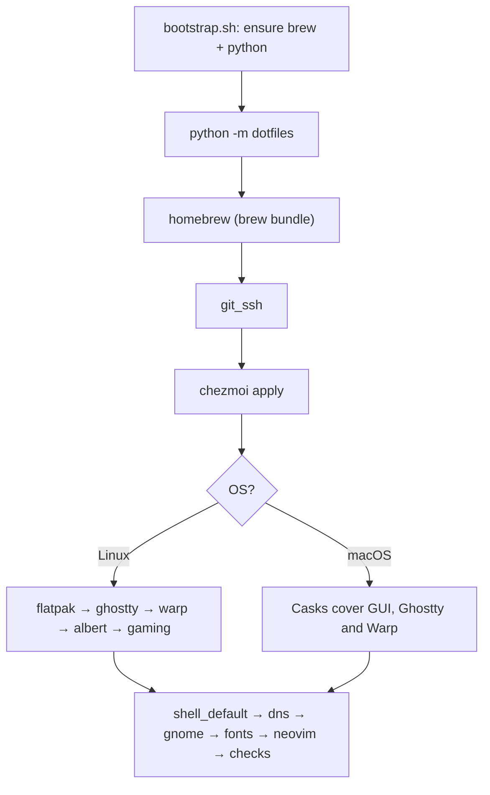

# Dotfiles

Reproducible setup for three targets that share one bootstrap and the same tooling:

- **macOS**
- **Bazzite** (atomic Fedora, gaming built in)
- **Fedora Silverblue** (atomic Fedora)

## Model

- **Home files → chezmoi** (`home/` source state via `.chezmoiroot`).
- **CLI tools → Homebrew** (`brewfile`), identical on every target.
- **GUI apps → Homebrew Casks on macOS, native Flatpak on Linux** (`flatpaks`).
- **Ghostty** → Homebrew cask on macOS; `scottames/ghostty` COPR layered with `rpm-ostree` on atomic Fedora.
- **Warp** → Homebrew cask on macOS; official Warp RPM repo layered with `rpm-ostree` on atomic Fedora.
- **Gaming** → native on Bazzite; Flatpaks (`flatpaks-gaming`) on Silverblue (+ optional rebase note).
- **GNOME desktop** → Dash to Dock + Tiling Shell on Linux from `dconf/`; Hammerspoon on macOS.

Flatpaks install via a dedicated step (not `brew bundle`). Flatpak **overrides** are applied by chezmoi under `~/.local/share/flatpak/overrides/`.

## Quick start

```bash
git clone git@github.com:bourbonfgiles/dotfiles.git ~/repos/personal/dotfiles
sh ~/repos/personal/dotfiles/bootstrap.sh
```

`bootstrap.sh` ensures Homebrew + Python, then `python -m dotfiles` runs ordered steps: brew bundle, git/ssh, **chezmoi apply**, Linux GUI/layering, shell, DNS drop-ins, GNOME, fonts, neovim, checks.

```bash
PYTHONPATH=src python3 -m dotfiles --list
PYTHONPATH=src python3 -m dotfiles --only chezmoi
```

## Bootstrap flow


```mermaid
flowchart TD
  S[bootstrap.sh: ensure brew + python] --> M[python -m dotfiles]
  M --> H["homebrew (brew bundle)"] --> G[git_ssh] --> C[chezmoi apply]
  C --> D{OS?}
  D -->|Linux| E[flatpak → ghostty → warp → albert → gaming]
  D -->|macOS| X[Casks cover GUI, Ghostty and Warp]
  E --> Z[shell_default → dns → gnome → fonts → neovim → checks]
  X --> Z
```

## Chezmoi layout

`.chezmoiroot` → `home/`:

```
home/
  dot_zshrc              → ~/.zshrc
  dot_spacemacs          → ~/.spacemacs
  dot_gitconfig.tmpl     → ~/.gitconfig   (from .chezmoidata.toml)
  dot_config/…           → ~/.config/…
  dot_local/share/flatpak/overrides/… → flatpak overrides
  dot_config/eza/theme.yml → ~/.config/eza/theme.yml (Smyck)
```

```bash
chezmoi --source ~/repos/personal/dotfiles apply
```

Git identity:

- **Personal** (committed): `home/.chezmoidata.toml` → global `~/.gitconfig`
- **Work** (not in git): copy `chezmoi.toml.example` → `~/.config/chezmoi/chezmoi.toml`, fill `[data.git.work]`, apply. That writes `~/.config/git/config-work`, included only for `~/repos/vitalhub/` via `includeIf`.

## Repository structure

```
home/             Chezmoi source state
system/           Linux resolved + NetworkManager drop-ins (dns step)
brewfile          Homebrew packages
flatpaks*         Flathub app ID lists
bootstrap.sh      Fresh-machine entry
dconf/            GNOME extension dconf
src/dotfiles/     Bootstrap package (stdlib only)
  services/       homebrew, git_ssh, chezmoi, flatpak, …
tests/
```

## Notes (Bazzite / Silverblue)

- chezmoi only writes `$HOME` — install via Homebrew.
- Ghostty/Warp still need `rpm-ostree` + reboot.
- DNS uses `system/resolved.conf.d/*` drop-ins (not a full rewrite of resolved.conf).
- Neovim config is chezmoi-managed; the neovim step only syncs plugins.

## Notes (brew on macOS)

`brew install hashicorp/tap/*` and similar will sometimes fail cloning with `could not read Username for 'https://github.com'`. Brew shells out to git with `GIT_TERMINAL_PROMPT=0` and `/opt/homebrew/etc/gitconfig` only sets `credential.helper=osxkeychain` — with nothing stored for `github.com`, git dies before it can fall through to anonymous cloning.

Fix (scoped to brew's git operations only — leaves `~/.gitconfig`, the included work identity, and clones in `~/repos/vitalhub/` untouched):

```ini
# /opt/homebrew/etc/gitconfig
[credential]
    helper = osxkeychain

[url "git@github.com:"]
    insteadOf = https://github.com/
```

This rewrites `https://github.com/...` to `git@github.com:...` whenever git reads brew's system gitconfig (every brew-driven clone). The existing personal SSH key registered under `bourbonfgiles` via `gh` and `~/.ssh/config` handles auth. Linuxbrew lives at `~/.linuxbrew/etc/gitconfig` and would need the same block on Linux if the same error appears there.

## Ghostty

Config is split under `home/dot_config/ghostty/`:

- `config` — includes the fragments
- `appearance` (Smyck) / `input` / `quake` / `platform`

## Dev checks

```bash
ruff check src tests && ruff format src tests
mypy src
PYTHONPATH=src pytest
```
